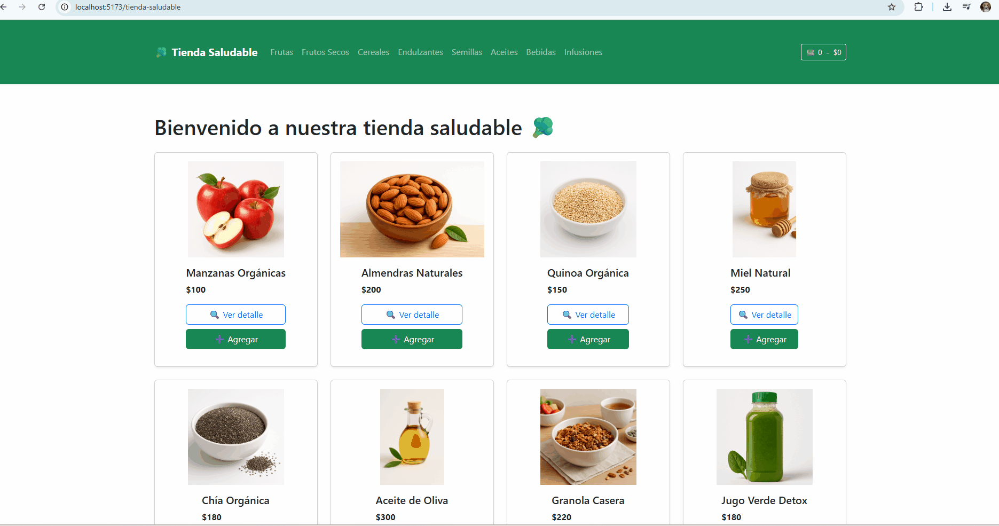

# 🥦 Tienda Saludable - Simoes Daniel Joel

Este proyecto corresponde a la **Pre Entrega 2** del curso de **React JS** en **Coderhouse**. Se trata de una tienda online de productos saludables desarrollada con React, que permite navegar entre diferentes vistas gracias a la implementación de **React Router**.

---

## 🧩 Componentes principales

- **App**: Componente raíz que contiene el layout general y las rutas.
- **NavBar**: Barra de navegación con enlaces a las categorías.
- **CartWidget**: Ícono del carrito con cantidad y precio total.
- **ItemListContainer**: Contenedor que obtiene productos y los muestra según la ruta.
- **ItemList**: Lista de productos que itera con `.map`.
- **Item**: Tarjeta individual de producto.
- **ItemDetailContainer**: Contenedor del detalle de un producto individual.
- **ItemDetail**: Vista con información completa de un producto.
- **ItemCount**: Selector de cantidad para agregar al carrito.
- **NotFound**: Página 404 para rutas inexistentes.

---

## 🧭 Funcionalidades implementadas

- ✅ Navegación sin recarga entre vistas con React Router.
- ✅ Catálogo general y catálogo filtrado por categoría (`/category/:id`).
- ✅ Vista de detalle para cada producto (`/item/:id`).
- ✅ Componente 404 para rutas inexistentes.
- ✅ Visualización del carrito (en evolución).
- ✅ Agregar productos con cantidad seleccionable (`ItemCount`).
- ✅ Diseño responsive con Bootstrap 5.
- ✅ Productos simulados con `Promise` + `setTimeout`.

---

## 🗂️ Estructura del proyecto

src/
├── assets/
├── components/
│ ├── CartWidget.jsx
│ ├── Item.jsx
│ ├── ItemCount.jsx
│ ├── ItemDetail.jsx
│ ├── ItemDetailContainer.jsx
│ ├── ItemList.jsx
│ ├── ItemListContainer.jsx
│ ├── NavBar.jsx
│ └── NotFound.jsx
├── App.jsx
├── main.jsx
├── styles.css

---

## 🔍 GIF de navegación

> 🎥 A continuación se muestra la navegación entre rutas: listado general, filtrado por categoría y vista en detalle de un producto.

## 🚀 Tecnologías utilizadas

- ⚛️ React JS
- 🔀 React Router DOM
- 🧩 Bootstrap 5
- 💬 React Toastify
- 💾 localStorage
- 🖼️ Promesas simuladas con `setTimeout`

---

## 🧠 Conceptos aplicados

- Ruteo dinámico con `react-router-dom`
- Uso de `useParams` para obtener ID de producto o categoría desde la URL
- Componentes contenedores (ItemListContainer, ItemDetailContainer) y presentacionales (Item, ItemDetail)
- Reutilización de componentes
- Manejo de estado con `useState` y `useEffect`

---

## 📌 Repositorio

[🔗 Repositorio en GitHub](https://github.com/joehouse90/tienda-saludable)

---

